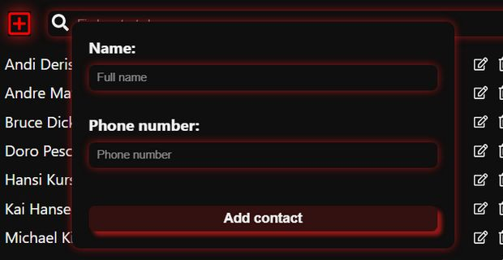
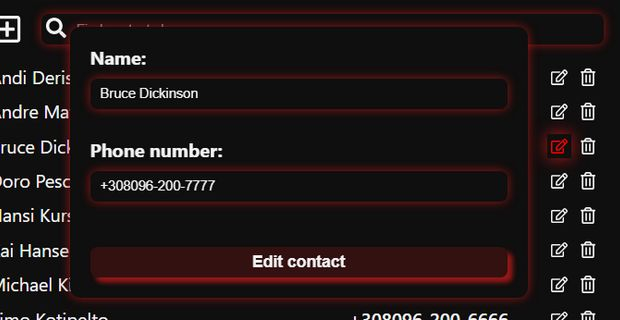
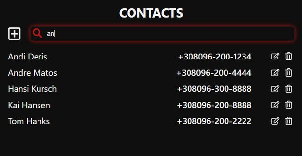
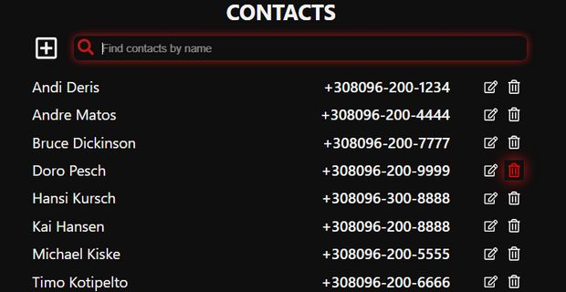

# Project "Phonebook". Frontend part

Phonebook - an application for storing the phone numbers of everyone you know.
The frontend is required to interact with the backtend.

What you can do in the Phonebook:

- **Add contact**

 

- **Edit contact**

 

- **Filter contact**

 

- **Delete contact**

## Related links

- 
- 
- 
- 
- 

## Technologies used on the Backend

## To use the repository you need

1. Clone this repository to your computer.
2. Open the terminal.
3. Run the command `npm install`.
4. Run the project with command `npm start`.

## Developer

